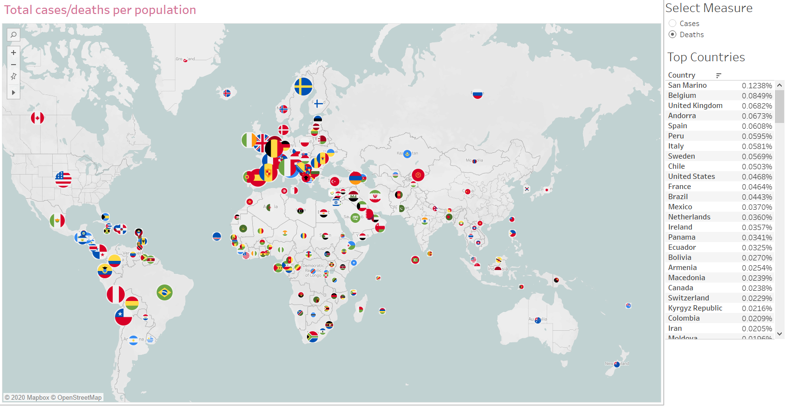
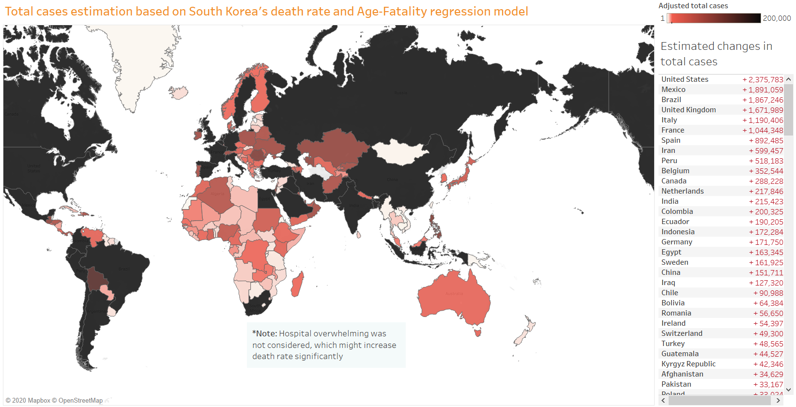
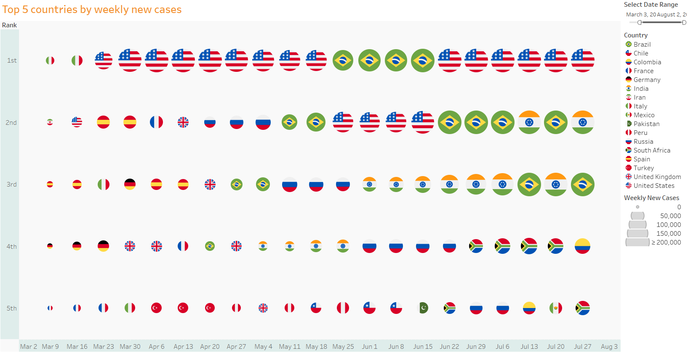
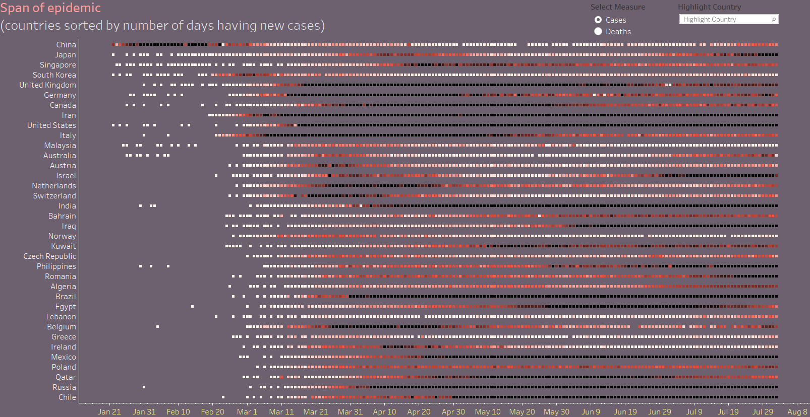

# Covid19

## Introduction
In this project, I used the John Hopkin University's dataset to analyze the Covid19 pandemic. Most analysis was done using Python, and for the final product, I created a Tableau dashboard to monitor the situation.

main.py is run daily and the dashboard is updated accordingly.

The interactive dashboard can be viewed at
https://public.tableau.com/views/ncov_15840779917890/Info?:display_count=y&publish=yes&:origin=viz_share_link
or downloaded from the tableau folder in this repo.
## Overview
Coronavirus disease 2019 (COVID-19) is a pandemic caused by the SARS-CoV-2 virus. Originated from Wuhan, it has spread to more than 100 countries and territories. The disease is extremely contagious and has seen exponential growth in China, Italy and Iran. As more people are infected, the country's medical resources are strained and fatal cases are becomming more common. 

## Spread of the virus
So far we have seen two major phases of the pandemic. In the first phase, the outbreak is fairly contained within China. In the second phase, the outbreak in Italy initialized a widespread of the virus all over the world, especially in Europe. This could be due to the free movement policy between Schengen countries and the hesitation of governments to limit travel.

## Active cases around the world
China started first and recorded massive growth in confirmed cases during February. However, in recent weeks there have been very few new cases being reported, while the situation in Italy is still becoming worse everyday.

## A comparison between total cases and total deaths
China was excluded from the image below.

## Total cases per population
Iceland, once again, is among the top performers with their small and vulnerable population. During 2009 H1N1, they were the country with highest confirmed case per capita.

## Estimating the real total cases number for different countries
An interesting debate during this pandemic is the hiding of information and lack of effort in testing people by some governments. Many speculate that the real number of infected people are much higher. Meanwhile, South Korea has been praised for its transparency level and for conducting huge amount of tests on its citizens.

Since a country is less likely to hide death resulted from the virus, I attempted to use the country's death counts and South Korea's case fatality rate (cfr) to estimate the real number of infected population. 

In addition, I also used a dataset from DXY.cn, which contains information such as age on about 3000 patients. Since the virus has been known to attack mostly older people, I can run a simple regression model to determine the coefficent of age on fatality, and use that to adjust the cfr for each country. The country's age data was retrieved from UN publication.

After the adjustment, we can see a huge increase in some countries,for example China, Italy, Iran. However, considering that these countries were at some point overwhelmed with too many patients, it's also possible that their cfr could be much higher than average.

## Comparison of number of new cases between countries

## Ranking countries on number of new cases for each week

## Span of epidemic

## Breakdown of China provinces
This image shows the distribution of cases in China, without Hubei.

